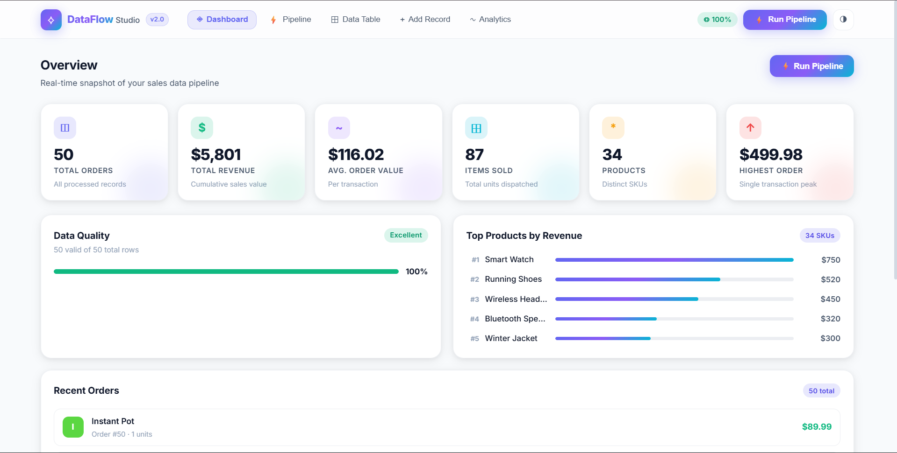
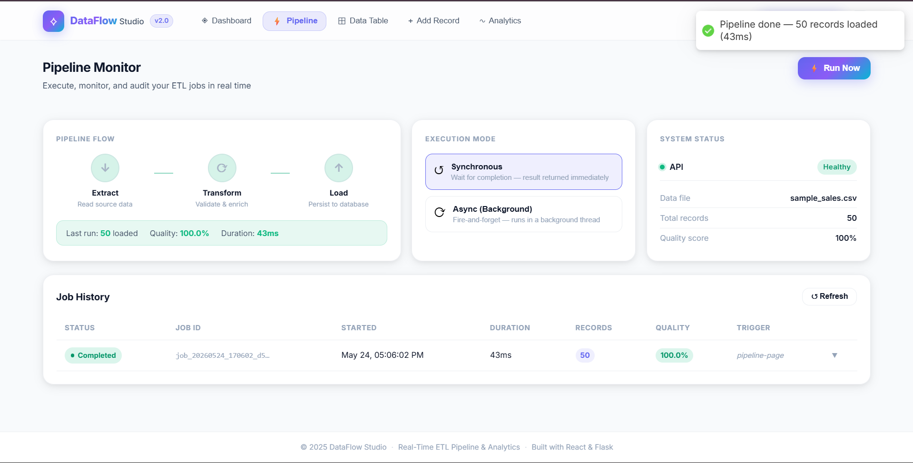
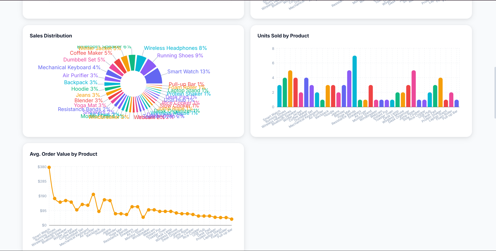
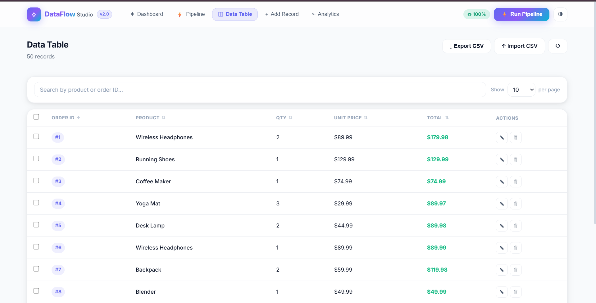
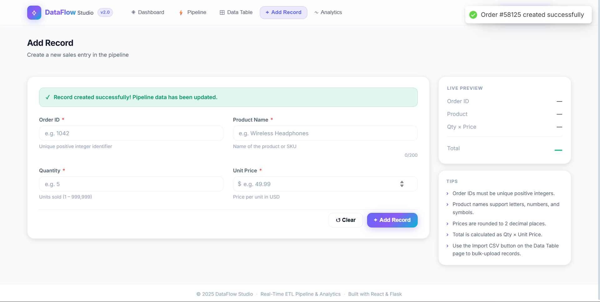

# ⟡ DataFlow Studio

**Real-Time ETL Pipeline & Analytics Platform**

[](https://python.org)
[](https://flask.palletsprojects.com)
[](https://react.dev)
[](https://pandas.pydata.org)
[](https://sqlite.org)
[](https://docker.com)

DataFlow Studio is a **production-grade, full-stack ETL pipeline** with a real-time analytics dashboard. It ingests raw CSV data, applies configurable validation and transformation rules, persists results to SQLite, and exposes a versioned REST API — all wrapped in a modern React frontend with live pipeline monitoring, data quality scoring, and interactive visualisations.

---

## 📸 Screenshots

### Dashboard


### Pipeline Monitor


### Analytics


### Data Table


### Add Record


---

## ✨ Features

| Category | Highlights |
|---|---|
| **Backend Engineering** | Clean Flask REST API · Retry with exponential backoff · Background async job processing (threading) · ETL job history in SQLite · Structured logging · Request-ID tracing · CORS + security headers |
| **ETL Core** | Extract (CSV / JSON / Excel) · Schema validation · Data quality scoring · Duplicate detection · Configurable transformations · Batch processing |
| **Analytics API** | Per-product aggregations · Time-series revenue · Top-N rankings · Data quality reports |
| **React Frontend** | Dashboard with KPI cards · Pipeline Monitor with step visualiser · Interactive Recharts charts · Inline record editing · CSV import/export · Skeleton loaders · Dark mode |
| **DevOps** | Multi-stage Docker build · docker-compose · `.env` configuration management · Health check endpoint |

---

## 🏗 Architecture

```
dataflow-studio/
├── api/
│   ├── index.py            <- Complete Flask app (all backend logic)
│   └── requirements.txt    <- Python dependencies
├── backend/
│   ├── extract.py          <- CSV / Excel extraction
│   ├── transform.py        <- Validation & enrichment
│   ├── load.py             <- SQLite persistence
│   ├── etl_pipeline.py     <- Pipeline orchestrator
│   ├── models.py           <- SQLAlchemy models
│   ├── schemas.py          <- Pydantic schemas
│   ├── logger.py           <- Structured logging
│   └── exceptions.py       <- Custom exceptions
├── frontend/
│   └── src/
│       ├── services/api.js <- Axios client with retry interceptors
│       └── components/     <- Dashboard · Pipeline · DataTable · Analytics · AddDataForm
├── data/sample_sales.csv   <- Seed dataset (50 records)
├── .env.example            <- Environment variable template
└── Dockerfile              <- Multi-stage build
```

**Data flow:**
```
CSV / Upload
    |
    v  Extract   (pandas.read_csv + encoding handling)
    |
    v  Transform (type coercion · dedup · validation · quality scoring)
    |
    v  Load      (SQLite via sqlite3 with WAL mode + retry)
    |
    v  REST API  ->  React Dashboard
```

---

## 🚀 Quick Start

### Prerequisites
- Python 3.10+
- Node.js 18+

### 1. Clone & install

```bash
git clone https://github.com/Raos0nu/ETL-Pipeline.git
cd ETL-Pipeline

# Python deps
python -m venv .venv

# Windows
.venv\Scripts\activate

# Mac / Linux
source .venv/bin/activate

pip install -r requirements.txt

# Node deps
cd frontend && npm install && cd ..
```

### 2. Configure

```bash
cp .env.example .env
# Defaults work out of the box for local dev
```

### 3. Run

**Dev mode (two terminals):**

```bash
# Terminal 1 — Flask API (port 5000)
python api/index.py

# Terminal 2 — React dev server (port 3001)
cd frontend && npm start
# Open http://localhost:3001
```

**Production build (single server):**

```bash
cd frontend && npm run build && cd ..
python api/index.py
# Open http://localhost:5000
```

**Docker (one command):**

```bash
docker compose up --build
# Open http://localhost:5000
```

---

## 📡 API Reference

Base URL: `http://localhost:5000`

### Health

```http
GET  /api/health      -> service info + db status
GET  /api/status      -> active jobs, recent runs, data file info
```

### Records

```http
GET    /api/data                  -> list (page, per_page, product, sort_by, sort_order)
GET    /api/data/:order_id        -> single record
POST   /api/data                  -> create  { order_id, product, quantity, price }
PUT    /api/data/:order_id        -> update  { product?, quantity?, price? }
DELETE /api/data/:order_id        -> delete
POST   /api/data/bulk-delete      -> { order_ids: [1,2,3] }
POST   /api/data/import           -> multipart CSV upload
GET    /api/data/export           -> download CSV
```

### Analytics

```http
GET  /api/analytics/overview     -> stats + quality report
GET  /api/analytics/products     -> per-product aggregations
GET  /api/analytics/timeseries   -> daily revenue/orders
GET  /api/analytics/summary      -> top-N products (?top=5)
```

### ETL Pipeline

```http
POST /api/etl/run                 -> { mode: "sync"|"async", triggered_by: "..." }
GET  /api/etl/status/:job_id      -> poll async job
GET  /api/etl/history             -> last N jobs (?limit=20)
```

**Sample ETL response:**
```json
{
  "success": true,
  "data": {
    "job_id": "job_20250101_120000_abc123",
    "status": "completed",
    "records_extracted": 50,
    "records_transformed": 50,
    "records_loaded": 50,
    "quality_score": 1.0,
    "quality_percentage": 100.0,
    "duration_seconds": 0.04
  }
}
```

---

## 🔧 Configuration

All settings via environment variables (see `.env.example`):

```ini
ENVIRONMENT=development        # development | production
DEBUG=true
PORT=5000
SECRET_KEY=change-me
CORS_ORIGINS=http://localhost:3001,http://localhost:5000
DATABASE_URL=sqlite:///dataflow.db
DATA_FILE=data/sample_sales.csv
LOG_LEVEL=INFO
ETL_MAX_RETRIES=3
ETL_RETRY_DELAY=0.5
ETL_QUALITY_THRESHOLD=0.80
```

---

## 📊 Sample Dataset

Shipped in `data/sample_sales.csv` — 50 orders across 5 product categories (Electronics, Apparel, Appliances, Fitness, Home Office). To load your own data, use the **Import CSV** button on the Data Table page.

**Required CSV columns:**

| Column | Type | Description |
|---|---|---|
| `order_id` | integer | Unique positive identifier |
| `product` | string | Product name or SKU |
| `quantity` | integer | Units sold |
| `price` | float | Unit price (USD) |

*Optional:* `category`, `created_at`

---

## 🛠 Tech Stack

| Layer | Technology |
|---|---|
| API Server | Python 3.12 · Flask 3.0 · flask-cors |
| Data Processing | Pandas 2.2 · NumPy |
| Database | SQLite (WAL mode) · SQLAlchemy |
| Validation | Pydantic v2 |
| Frontend | React 18 · Recharts · react-hot-toast |
| Containers | Docker · Docker Compose |

---

## 🗺 Roadmap

- [ ] PostgreSQL for persistent production storage
- [ ] Cron-triggered scheduled ETL jobs
- [ ] Multi-source ingestion: REST APIs, Amazon S3, Google Sheets
- [ ] JWT-based authentication
- [ ] Prometheus `/metrics` endpoint
- [ ] Row-level audit trail

---

## 👤 Author

**Sonu Yadav** — Final-year CSE student · Backend & Data Engineering

📧 sonuyadav97297@gmail.com
